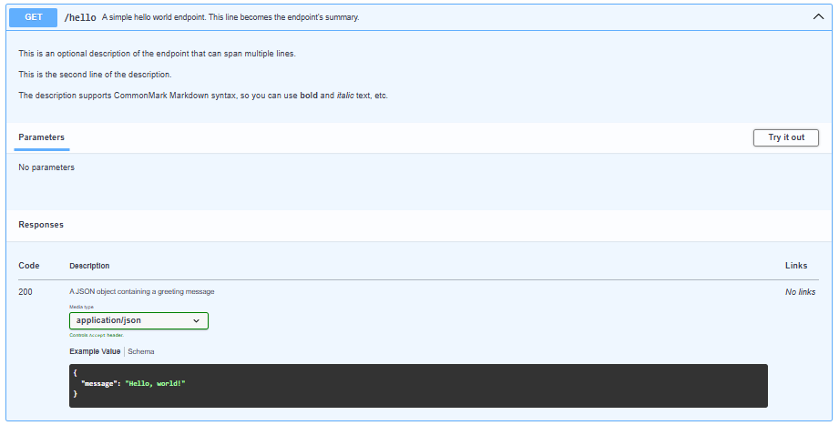

# Framework

The API is built using a custom framework that relies on decorators to mark functions as API endpoints. The framework is designed to be simple and easy to use, and to provide a consistent way to define API endpoints.

## Defining an API endpoint

An API endpoint is defined by creating a new function and decorating it with the `@route` decorator that takes the path of the endpoint, and the HTTP method as arguments. You will need to import the `route` decorator from the `routes` module:

```python
from routes import route
```

For example, we can declare a new function in `lambda_function.py` as follows:

```python
@route('/hello', 'GET')
def hello():
    """A simple hello world endpoint. This line becomes the endpoint's summary.

    This is an optional description of the endpoint that can span multiple lines.

    This is the second line of the description.
    
    The description supports CommonMark Markdown syntax, so you can use **bold** and *italic* text, etc.
    ---
    responses:
      200:
        description: A JSON object containing a greeting message
        content:
          application/json:
            schema:
              type: object
              properties:
                message:
                  type: string
                  example: Hello, world!
    """
    return {'message': 'Hello, world!'}
```

Note that the docstring of the function is used to provide a summary and description of the endpoint, which is used to generate the API documentation. It follows the [Open API Spec Format in YAML](https://swagger.io/docs/specification/v3_0/basic-structure/), except the summary and description are automatically extracted from the docstring without having to specify them in the YAML.

This generates the following documentation for the `/hello` endpoint:



> [!NOTE]
>
> All API endpoints are automatically documented with basics information by `docgen.py`. For example, if the above endpoint does not have a docstring, the documentation will still include the path, method, and a default response.
>
> It is still recommended to provide a docstring with a summary and description for each endpoint to make the documentation more informative.

### Grouping Endpoints

Endpoints can be grouped into a `.py` file based on their functionality. For example, all user-related endpoints can be grouped in a `routes/users.py` file. 

A `routes/__init__.py` file should import the endpoints from the individual files to make them accessible.

`routes/__init__.py`:
```python
from . import users # assuming users.py contains user-related endpoints
```

## Middleware

The framework supports middleware functions that can be used to perform operations before the code of an endpoint is executed. To use middleware, you need to import the `use` decorator from the `middleware` module:

```python
from utils import use
```

A middleware is a function that takes three parameters: `event`, `response` and `context`, and returns the same three parameters for the next middleware.

```python
def middleware(event, response, context):
    # Perform some operation here
    return event, response, context
```

For example, consider an `authenticate` middleware that uses a JSON web token to authenticate the user:

```python
def authenticate(event, response, context):
    """Middleware to authenticate the user using a JSON web token.
    ---
    security:
        - bearerAuth: []
    """
    headers = event['headers']
    if headers is None:
        response.status(401).json({
            "success": False,
            "comment": f'NO_HEADERS',
        })
        return event, response, context
    bearer = headers.get('Authorization', None)
    if bearer is None:
        response.status(401).json({
            "success": False,
            "comment": f'NO_AUTHORIZATION_HEADER',
        })
        return event, response, context
    if not bearer.startswith('Bearer '):
        response.status(401).json({
            "success": False,
            "comment": f'INVALID_AUTHORIZATION_HEADER',
        })
        return event, response, context
    session_token = bearer[7:]
    if not validate_session_token(session_token):
        response.status(401).json({
            "success": False,
            "comment": "SESSION_TOKEN_EXPIRED",
        })
        return event, response, context
    event['user'] = jwt.decode_token(session_token)
    return event, response, context
```

The `authenticate` middleware can be applied to an endpoint by using the `@use` decorator:

```python
@route('/protected', 'GET')
@use(authenticate)
def protected(event, response, context):
    """A protected endpoint that requires authentication.
    ---
    responses:
      200:
        description: A JSON object containing a secret message
        content:
          application/json:
            schema:
              type: object
              properties:
                message:
                  type: string
                  example: You are authenticated!
    """
    return {'message': 'You are authenticated!'}
```

> [!WARNING]
>
> If any of the middleware needs access to `event`, `response`, or `context`, they must be declared as parameters in the function signature in the above order, regardless of whether they are used or not in the function body.

## The `Response` class

The `response` object in a route or middleware function is an instance of the `Response` class, which provides methods to set the status code and send JSON responses. The `Response` class is defined in the `utils` module:

```python
from utils import Response
```

It can be used to send responses back to the client (even in middleware). It provides methods to set the status code and send JSON responses.

An example of using the `response` object is shown in the `authenticate` middleware above. The `response` object is used to send a 401 Unauthorized response if the user is not authenticated.