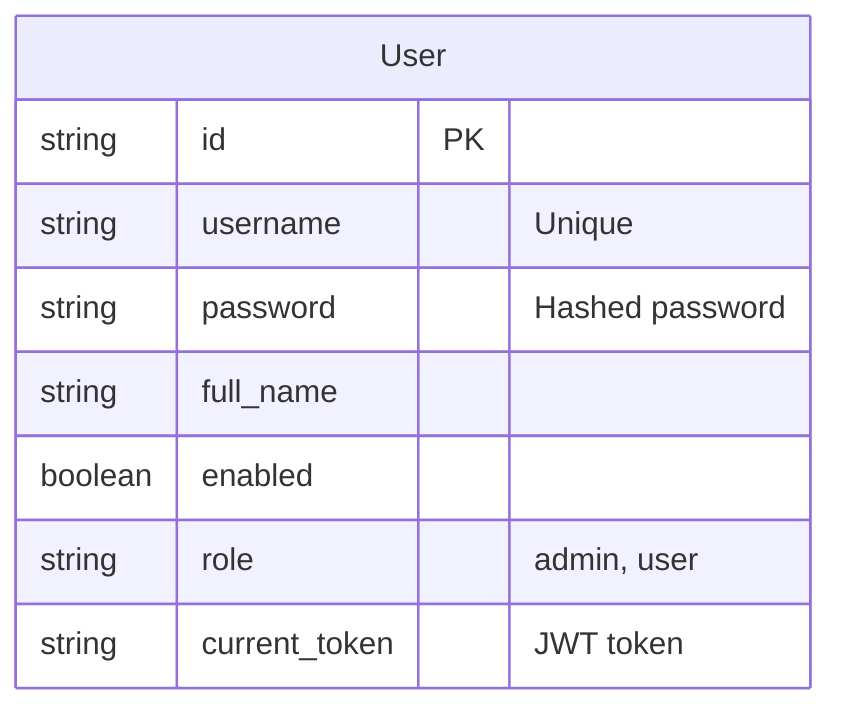
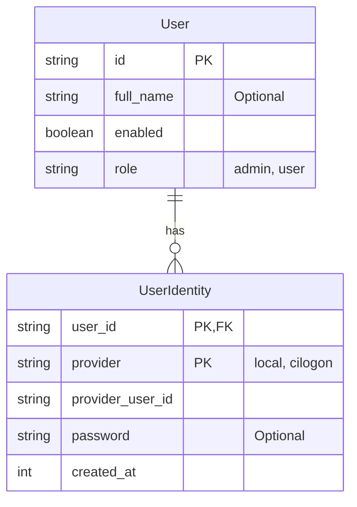

# AAO CILogon Integration

The following pull requests (https://github.com/ADMSCentre/australian-ad-observatory-api/pull/5) introduces two API endpoints to support CILogon integration:

* `/auth/cilogon/login` redirects to CILogon for authentication.
* `/auth/cilogon/callback` handles the callback from CILogon, retrieving the necessary user information and returning it in the response.

## Implementation Plan

Users currently get created with /users (POST) endpoint. It requires a username and a password. Users from CILogon won't have a username but they will have an email.

Consider:

* Remove the requirement for username and password (make them optional). Each user now has a unique ID.
* Add email as another optional field.
* Add another `user_identities` table with the following columns:
  * `user_id`: Foreign key to the `users` table.
  * `provider`: The identity provider (e.g., CILogon).
  * `provider_user_id`: The unique identifier for the user from the identity provider (e.g., CILogon ID).
  * `created_at`: Timestamp of when the identity was created.
* For current users, if they have a username, create a record in the `user_identities` table with the provider set to 'local' and the `provider_user_id` set to their username.
* By doing this, we can support both local users and SSO users (like CILogon) without changing the existing user management system.

The systems affected by this change include:

- The RDS PostgreSQL database
- The Lambda functions and multiple functions will be updated
- The front-end will also need to be updated to accommodate the new approach.

### Current Schema



### Updated Schema



## Scope

Prior to the main task, we need to separate the production and development environments, including:

* A new `aao_v2_dev` database in the current RDS instance - this is where we will apply the migrations.
  * Will need to copy the current production database to the dev database.
* A new `fta-mobile-observations-api-dev` Lambda function that will use the dev database.

* Add a migration script to:
  * Create a user_identities table
  * Populate the user_identities table with local identities, using the username of current users as the provider_user_idand and move the password field from usersto user_identities
  * Remove the username and password fields from the users table
  * Should we stop storing JWT in the database? Yes, this breaks stateless design & it is not critical to disable "sessions" -> will need to update jwt.py to stop looking up current token
  * Update ad_attributes table's created_by and modified_by to reference the user_id instead of username

* Update JWT schema to include:
  * user_id (instead of username)
  * full_name
  * role
  * enabled

* Update API endpoints:
  * [POST] `users` should require (username, email, password) then 
    * create a new user in the users table as usual
    * insert into user_identities values (user_id, "local", username, password, current_timestamp)

* [GET] users should return a list of the following fields: (user_id, full_name, role, enabled) BREAKING CHANGE - WILL NEED TO UPDATE FRONT-END

* auth/cilogon/callback should select user_id from user_identities where provider = "cilogon" and provider_user_id = cilogon_client_id to check if a user already exists, and
  * if not found, create_new_cilogon_user(cilogon_client_id)
    * create a new user in the users table, then
    * insert into user_identities values (user_id, "cilogon", cilogon_client_id, current_timestamp)
    * return JWT generated from the new user

  * if found, select id, full_name, role, enabled from users where id = user_id and return the JWT generated from the matched user

* Update front end:
  * The user management table (at /users) should no longer show the username and password -> will need a different design to accommodate password editing for "local" authentication
  * 'local' vs CILogon sign-in: add CILogon interface but hide until alcohol study concludes

## Future Considerations

* Account linking - add an endpoint `auth/link_account` to allow users to link different identities to the same user(e.g., add a link to the self/edit endpoint to add CILogon identity to their account)
* [SELECTED FOR DEVELOPMENT] Email notification - should email be a field in users (like a primary email address) or user_identities (each identity provider may use a different email address), or a separate table user_email

## Execution

### [x] Setting up Alembic as the Migration Tool

Since we are using SQLAlchemy to interact with a PostgreSQL database (hosted as an RDS instance), we can use Alembic as the migration tool. [Alembic](https://alembic.sqlalchemy.org/en/latest/) is part of the SQLAlchemy project and can be used to manage database migrations.

**Step 1: Install Alembic**

Add Alembic to the project dependencies:

```bash
pip install alembic
```

Add `alembic` to `requirements.txt`:

```
alembic>=1.16.4
```

**Step 2: Initialize Alembic**

Initialize Alembic in the project root directory:

```bash
alembic init alembic
```

This creates:
- `alembic/` directory with migration scripts
- `alembic.ini` configuration file
- `alembic/env.py` environment configuration

**Step 3: Configure Alembic**

Since we'll be reading the database configuration from `config.ini` in the `env.py` file, we don't need a separate database URL in `alembic.ini`. Instead, we will set the database URL dynamically in `alembic/env.py`.

The actual database connection will be configured in `env.py` using the same `config.ini` file that the Lambda function uses.

**Step 4: Update env.py**

Modify `alembic/env.py` to import our SQLAlchemy models and configure the target metadata:

```python
# alembic/env.py
import os
import sys
from logging.config import fileConfig
from sqlalchemy import engine_from_config, pool
from alembic import context
from configparser import ConfigParser
from models.base import Base

# Add the project root to the Python path
sys.path.append(os.path.dirname(os.path.dirname(__file__)))

# Read database configuration from config.ini
config_parser = ConfigParser()
config_parser.read('config.ini')

DB_HOST = config_parser.get('POSTGRES', 'HOST')
DB_PORT = config_parser.get('POSTGRES', 'PORT')
DB_DATABASE = config_parser.get('POSTGRES', 'DATABASE')
DB_USERNAME = config_parser.get('POSTGRES', 'USERNAME')
DB_PASSWORD = config_parser.get('POSTGRES', 'PASSWORD')

db_url = f'postgresql://{DB_USERNAME}:{DB_PASSWORD}@{DB_HOST}:{DB_PORT}/{DB_DATABASE}'

# this is the Alembic Config object
config = context.config

# Set up target metadata
target_metadata = Base.metadata

# Configure database URL from config.ini
config.set_main_option("sqlalchemy.url", db_url)
```

**Step 5: Create Initial Migration**

> [!NOTE]
>
> This step should be done if the database is empty, and it is intended to populate the database with the current state of the models. If the database already has data, there is no need to create an initial migration, as the existing data will be preserved.

Generate the initial migration based on current models.

```bash
alembic revision --autogenerate -m "Initial migration"
```

This will create a migration file in `alembic/versions/` that captures the current state of your database schema.

**Step 6: Run Migrations**

Apply migrations to the development database:

```bash
alembic upgrade head
```

This command applies all pending migrations to the database, updating its schema to match the current state of your models.

### [x] Update the Models

Before generating the migration script, we need to update the relevant models to support the new schema for CILogon integration.

**Changes made to `models/user.py`:**
- Created new `UserIdentityORM` model for the `user_identities` table with:
  - Composite primary key (`user_id`, `provider`)
  - Foreign key to `users.id`
  - Fields: `provider_user_id`, `password` (nullable), `created_at`
- Updated `UserORM` model:
  - Removed: `username`, `password`, `current_token` fields
  - Made `full_name` nullable for CILogon users
  - Added relationship to `user_identities`
- Created corresponding Pydantic models: `User` and `UserIdentity`

**Changes made to `models/attribute.py`:**
- Updated comments to clarify `created_by` and `modified_by` will reference `user.id` instead of username
- No structural changes (data migration handles the reference updates)

### [x] Generate Migration Script

The migration script handles both schema changes and data migration to ensure no data loss.

**Step 1: Generate Initial Migration**

```bash
alembic revision --autogenerate -m "Add user_identities table for sso"
```

**Step 2: Customize the Migration Script**

The auto-generated migration was customized to include:

**Upgrade process:**
- Create `user_identities` table with proper constraints
- Migrate existing user data to `user_identities` with provider='local'
- Update `ad_attributes` references from username to user_id
- Make `full_name` nullable
- Drop old columns (`username`, `password`, `current_token`)

**Downgrade process:**
- Restore old schema by re-adding dropped columns
- Migrate data back from `user_identities` to `users` (local users only)
- Restore constraints and references
- Drop `user_identities` table
- **Warning**: CILogon user data will be lost during downgrade

**Step 3: Test the Migration**

```bash
# Apply the migration
alembic upgrade head
```

**Verification checks:**
- `user_identities` table exists and is populated
- `users` table has correct schema  
- `ad_attributes` references are updated
- No data loss occurred

**Step 4: Verification Queries**

After migration, run these queries to verify the data migration was successful:

```sql
-- Check that all original users have local identities
SELECT COUNT(*) FROM users;
SELECT COUNT(*) FROM user_identities WHERE provider = 'local';
-- These counts should match

-- Check that ad_attributes references are valid user IDs
SELECT COUNT(*) FROM ad_attributes a 
LEFT JOIN users u ON a.created_by = u.id 
WHERE u.id IS NULL;
-- Should return 0

-- Check for any orphaned references
SELECT COUNT(*) FROM ad_attributes a 
LEFT JOIN users u ON a.modified_by = u.id 
WHERE u.id IS NULL;
-- Should return 0
```

### [ ] Update the API Endpoints - Local Authentication

The breaking changes to the `User` model include removing the `username` and `password` fields, and introducing the `user_identities` table for managing user authentication. The API endpoints will need to be updated accordingly.

This section outlines the necessary changes to ensure local authentication still works with the new `user_identities` table structure. CILogon integration will be handled separately in the next section.

The following files and functions are affected by the user model changes and need to be updated to work with the new `user_identities` table structure:

**Core Routes - `/routes/users.py`**
- **`list_users()`**: 
  - OpenAPI schema includes `username` and `password` fields
  - `get_user_dict()` helper returns `(id, username, enabled, full_name, role)`
  - Uses `user.username` from UserORM model
- **`create_user()`**: 
  - Requires `(username, enabled, password, full_name, role)` parameters
  - Checks for existing user with `session.get_first({'username': new_user['username']})`
  - Stores hashed password directly in user record
- **`edit_user()`**: 
  - Uses path parameter `{username}` for user identification
  - Performs lookup with `session.get_first({'username': username})`
  - Authorization checks `caller['username'] != username`
  - Updates password directly in user record
- **`get_current_user()`**: 
  - Looks up user with `session.get_first({'username': event['user']['username']})`
  - Returns user data including username and password fields
- **`get_user()`**: 
  - Uses path parameter `{username}` for user identification
  - Performs lookup with `session.get_first({'username': username})`
  - Authorization checks `caller['username'] != username`
- **`delete_user()`**: 
  - Uses path parameter `{username}` for user identification
  - Performs deletion with `session.delete({'username': username})`

> [!NOTE]
>
> The above endpoints now only manage `local` users, so they will need to be updated to work with the new `user_identities` table structure, including:
> - When provided with a `username`, look up the user in the `user_identities`, then use the `user_id` to identify the user in the `users` table and perform operations accordingly
> - When updating the display name, the `full_name` field in the `users` table should be updated
> - When updating the password, the `password` field in the `user_identities` table should be updated
> - When creating a new user, a record should be inserted into both tables:
>   - `users` table with `full_name`, `enabled`, `role`
>   - `user_identities` table with `provider='local'`, `provider_user_id=username`, `password`, `created_at`
> - When deleting a user, delete the record from `user_identities` table, and if no other identities exist for that user, delete the record from the `users` table as well
> - When listing users, the `list_users()` endpoint should return user data from the `users` table, but the `username` field should be retrieved from the `user_identities` table.

**Authentication Routes - `/routes/auth.py`**
- **`login()`**: 
  - Calls `jwt.create_session_token(username, password)` with username from request body
  - Expects JWT payload to contain username-based user identification
- **`logout()`**: 
  - Calls `jwt.disable_session_token(token)` to invalidate the current session
- **`refresh()`**: 
  - Calls `jwt.refresh_session_token(token)` with token from request body

> [!NOTE]
>
> `login()` authenticates `local` users hence requires username and password. We want to keep this signature, but the implementation will need to:
> - Look up the user in the `user_identities` table
> - Validate password
> - Call `jwt.create_token_from_identity(user_identity)` to create JWT token -> new function to be implemented in `jwt.py`
>
> Re-think the JWT payload - `username` is no longer appropriate. Refer to the `jwt.py` section below for the new JWT payload structure.
>
> `logout()` is no longer needed with the stateless JWT design - client needs to delete the stored token themselves.
>
> `refresh()` is no longer secure as a JWT can be extended indefinitely. This endpoint should be removed, and the client should handle token expiration by prompting the user to log in again.

**Other Affected Routes**
- **`/routes/ad_attributes.py`**:
  - **`create_ad_attribute()`**: Uses `username = event['user']['username']` from JWT payload and sets `created_by=username, modified_by=username` in database
- **`/routes/projects.py`**:
  - **`get_project_member()`**: Searches team members with `member.get('username') == username`
  - **`list_projects()`**: Uses `event['user']['username']` for project member filtering
  - **`create_project()`**: Sets `ownerId=event['user']['username']` and creates team member with `'username': event['user']['username']`
  - **`get_project()`**: Authorization checks use `project['ownerId'] == user['username']` and `member['username'] == user['username']`

> [!NOTE]
>
> The event['user'] will now be a `UserIdentityORM` object, and occurrances of `event['user']['username']` should be replaced with `event['user'].id` to reference the user ID from the `users` table.
>
> The exception is `get_project()` will check against `user.identities[i].provider_user_id` to match the username from the `user_identities` table. This will be changed later when the `Project` model is migrated to RDS.

- **`/routes/guest.py`**:
  - JWT payload structure includes `"username": key` for guest sessions

> [!NOTE]
> The JWT payload for guest sessions will now include a `sub` field with a UUID4 generated user ID, and the `username` field will be replaced with `sub` to maintain consistency with other user sessions. The `username` field will no longer be used for guest sessions.

**Middleware Updates - `/middlewares/authenticate.py`**
- **`authenticate()`**: 
  - Sets `event['user'] = jwt.decode_token(session_token)` where JWT payload contains username-based user data
  - Decoded JWT payload structure includes username field that downstream functions expect

> [!NOTE]
>
> The `authenticate()` middleware will need to be updated to decode the JWT token and extract the `sub` field as the user ID, and use this to look up the user in the `users` table.
>
> The `event['user']` will now be a `UserORM` object.

**Utility Functions - `/utils/jwt.py`**
- **`create_session_token()`**: 
  - Takes `username` and `password` parameters for local authentication
  - Calls `get_user_data(username)` to retrieve user from S3-based storage
  - Validates password against `user_data["password"]` field stored in user record
- **`create_token()`**: 
  - Creates JWT payload including username and all user fields except password
  - Stores `current_token` in user record for session management
- **`get_user_data()`**: 
  - Retrieves user data from S3 storage using username as identifier
  - Returns user data including username, password, and other fields from old model
- **`disable_session_token()`**: 
  - Updates user record to set `current_token = None` for session invalidation
  - Uses username from JWT payload to identify user record
- **S3-based session management**: Creates session objects in S3 with token information for session validation

> [!NOTE]
>
> JWT should now be totally stateless and contains the following fields:
>
> Standard claims:
> - `sub` - subject identifier, in this case the user ID from the `users` table (if `guest`, this will be uuid4 generated)
> - `iat` - issue timestamp
> - `exp` - expiration timestamp
>
> Additional claims:
> - `role` - can be `guest`, `user`, `admin` and possibly others in the future
> - `full_name`
> - `enabled`
> - `provider` - the identity provider (e.g., `local`, `cilogon`, or `null` for guests)
>
> There will be some additional helper functions:
>
> - `create_token_from_identity(user_identity_id)` - creates JWT token from `user_identities` table
> - `create_guest_token()` - creates JWT token for guest users with `sub` as a UUID4 generated user ID

**Test Files**
- **`/apitests/test_users.py`**:
  - **`create_test_user()`**: Creates test user with `'username': username, 'password': 'testpassword'` structure
  - **`get_user()`**: Uses `f'/users/{username}'` endpoint path with username parameter
  - **`delete_user()`**: Uses `f'/users/{username}'` endpoint path with username parameter
  - **`test_list_users()`**: Asserts presence of `'username'` field in user objects
- **`/apitests/test_auth.py`**: 
  - Login tests use `'username': username, 'password': password` request structure
- **`/apitests/base.py`**: 
  - Authentication helpers use username/password credentials from config for test authentication
- **All other test files**: Username-based lookups and JWT payload expectations throughout test suite

**Breaking Changes for Frontend**
- **Current User Management Interface**: 
  - Displays username and password fields in user tables
  - User editing forms work with username-based identification
  - Uses username-based URL paths like `/users/{username}`
- **Current API Response Structure**:
  - `/users` endpoint returns user objects including username and password fields
  - User paths use `/users/{username}` format
  - JWT payload contains username for user identification
- **Use `logout` endpoint**: 
  - Calls `/auth/logout` to invalidate the current session

Based on the above notes and following the order of dependencies, the following tasks need to be completed:

- [x] `users` API endpoints to work with the new `user_identities` table structure for local authentication
- [x] `jwt.py` utility functions to create JWT tokens from `user_identities` and use the new JWT payload structure
- [x] `authenticate()` middleware to decode JWT and set `event['user']` as `User` object and `event['identity']` as `UserIdentity` object
- [x] Other affected routes to use `event['user'].id` for user identification instead of `username` (except for `get_project()` which will use `user.identities[i].provider_user_id`)
- [x] Test files to work with the new user model and removed deprecated logout/refresh endpoints
- [ ] Update the frontend to accommodate the new user model and API response structure

### [x] CILogon Integration

**Authentication Routes - `/routes/auth.py`**
- **`cilogon_authorize()`**: 
  - Uses `userinfo.get("email")` as username in `app_user_data = {"username": userinfo.get("email")}`
  - Calls `jwt.create_token_after_external_auth(app_user_data)` expecting username-based lookup

**Utility Functions - `/utils/jwt.py`**
- **`create_token_after_external_auth()`**: 
  - Expects `external_user_details` to contain `username` field
  - Calls `get_user_data(username)` to find existing user by username

**New CILogon Endpoints**  
- **`/auth/cilogon/login`**: Already implemented - redirects to CILogon
- **`/auth/cilogon/authorize`**: Creates JWT token by using the `email` from CILogon userinfo as `username`

> [!NOTE]
>
> The CILogon integration will need to be updated to use the new `user_identities` table structure by storing the identity in the `user_identities` and manage associated user in the `users` table.
>
> The `provider_user_id` can be obtained from the `sub` field in the CILogon userinfo, which is a unique identifier for the user in the CILogon system. This will be used to create or update the `user_identities` table.
>
> The CILogon userinfor also provides a `name` field which can be used to populate the `full_name` field in the `users` table.
>
> Since we don't want CILogon users (so anyone) to be able to access the API, they will be created with `enabled=False`. An admin will need to enable them manually.

### [x] External User Identity Management

Using CILogon, anyone can create an account and we don't want them access to the API or dashboard. After the CILogon integration, external users are created with `enabled=False`, but there is no way to enable them from the API or dashboard.

To allow management of external user identities, we need to implement the following:

- [x] Add a new endpoint [GET] `/users/external` to list all external user (users whose only identity is from CILogon)
- [x] Add a new endpoint [POST] `/users/external/{user_id}/enable` to enable an external user
- [x] Add a new endpoint [POST] `/users/external/{user_id}/disable` to disable an external user
- [x] Add a new endpoint [DELETE] `/users/external/{user_id}` to delete an external user - this will delete the user from both `users` and `users_identities` tables
- [x] Add a new endpoint [GET] `/users/external/{user_id}` to get the details of an external user