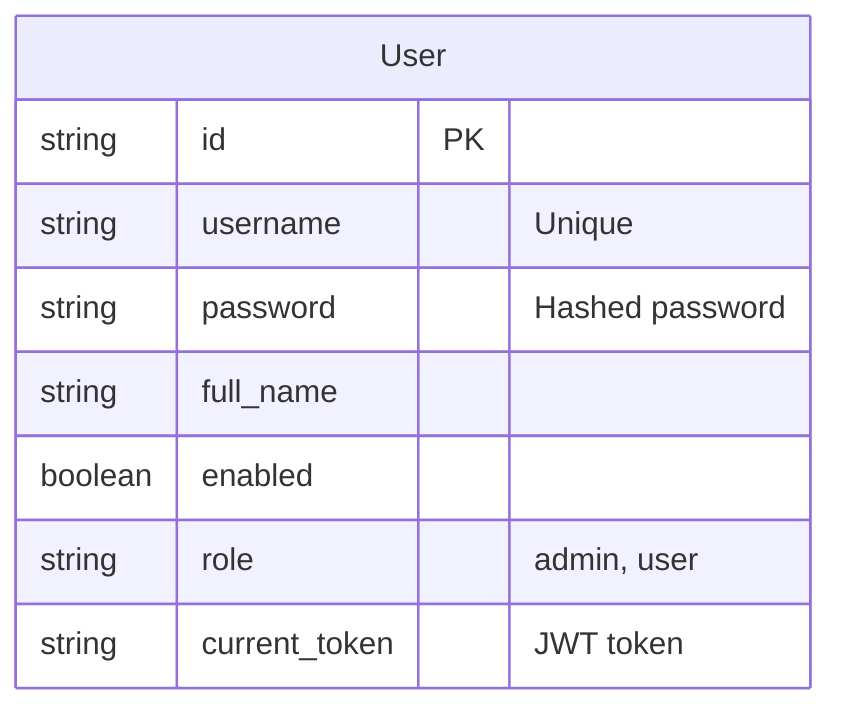
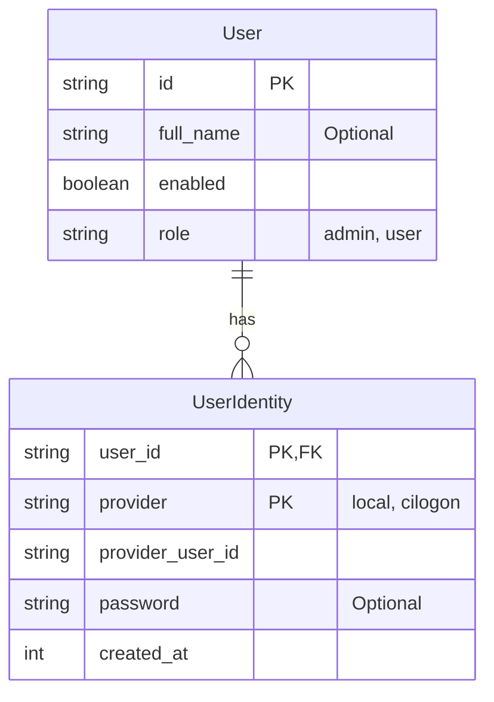

# AAO CILogon Integration

The following pull requests (https://github.com/ADMSCentre/australian-ad-observatory-api/pull/5) introduces two API endpoints to support CILogon integration:

* `/auth/cilogon/login` redirects to CILogon for authentication.
* `/auth/cilogon/callback` handles the callback from CILogon, retrieving the necessary user information and returning it in the response.

## Implementation Plan

Users currently get created with /users (POST) endpoint. It requires a username and a password. Users from CILogon won't have a username but they will have an email.

Consider:

* Remove the requirement for username and password (make them optional). Each user now has a unique ID.
* Add email as another optional field.
* Add another `user_identities` table with the following columns:
  * `user_id`: Foreign key to the `users` table.
  * `provider`: The identity provider (e.g., CILogon).
  * `provider_user_id`: The unique identifier for the user from the identity provider (e.g., CILogon ID).
  * `created_at`: Timestamp of when the identity was created.
* For current users, if they have a username, create a record in the `user_identities` table with the provider set to 'local' and the `provider_user_id` set to their username.
* By doing this, we can support both local users and SSO users (like CILogon) without changing the existing user management system.

The systems affected by this change include:

- The RDS PostgreSQL database
- The Lambda functions and multiple functions will be updated
- The front-end will also need to be updated to accommodate the new approach.

### Current Schema



### Updated Schema



## Scope

Prior to the main task, we need to separate the production and development environments, including:

* A new `aao_v2_dev` database in the current RDS instance - this is where we will apply the migrations.
  * Will need to copy the current production database to the dev database.
* A new `fta-mobile-observations-api-dev` Lambda function that will use the dev database.

* Add a migration script to:Create a user_identities table
  * Populate the user_identities table with local identities, using the username of current users as the provider_user_idand and move the password field from usersto user_identities
  * Remove the username and password fields from the users table
  * Should we stop storing JWT in the database? Yes, this breaks stateless design & it is not critical to disable "sessions" -> will need to update jwt.py to stop looking up current token
  * Update projects team and owner fields to reference user_id instead of username
  * Update ad_attributes table's created_by and modified_by to reference the user_id instead of username
* Update JWT schema to include:
  * user_id (instead of username)
  * full_name
  * role
  * enabled
* Update API endpoints:
  * [POST] `users` should require (username, email, password) then 
    * create a new user in the users table as usual
    * insert into user_identities values (user_id, "local", username, password, current_timestamp)
* [GET] users should return a list of the following fields: (user_id, full_name, role, enabled) BREAKING CHANGE - WILL NEED TO UPDATE FRONT-END
* auth/cilogon/callback should select user_id from user_identities where provider = "cilogon" and provider_user_id = cilogon_client_id to check if a user already exists, and
  * if not found, create_new_cilogon_user(cilogon_client_id)
    * create a new user in the users table, then
    * insert into user_identities values (user_id, "cilogon", cilogon_client_id, current_timestamp)
    * return JWT generated from the new user
* if found, select id, full_name, role, enabled from users where id = user_id and return the JWT generated from the matched user
* Update front end:
  * The user management table (at /users) should no longer show the username and password -> will need a different design to accommodate password editing for "local" authentication
  * 'local' vs CILogon sign-in: add CILogon interface but hide until alcohol study concludes

## Future Considerations

* Account linking - add an endpoint `auth/link_account` to allow users to link different identities to the same user(e.g., add a link to the self/edit endpoint to add CILogon identity to their account)
* [SELECTED FOR DEVELOPMENT] Email notification - should email be a field in users (like a primary email address) or user_identities (each identity provider may use a different email address), or a separate table user_email

## Execution

### Setting up Alembic as the Migration Tool

Since we are using SQLAlchemy to interact with a PostgreSQL database (hosted as an RDS instance), we can use Alembic as the migration tool. [Alembic](https://alembic.sqlalchemy.org/en/latest/) is part of the SQLAlchemy project and can be used to manage database migrations.

**Step 1: Install Alembic**

Add Alembic to the project dependencies:

```bash
pip install alembic
```

Add `alembic` to `requirements.txt`:

```
alembic>=1.16.4
```

**Step 2: Initialize Alembic**

Initialize Alembic in the project root directory:

```bash
alembic init alembic
```

This creates:
- `alembic/` directory with migration scripts
- `alembic.ini` configuration file
- `alembic/env.py` environment configuration

**Step 3: Configure Alembic**

Since we'll be reading the database configuration from `config.ini` in the `env.py` file, we don't need a separate database URL in `alembic.ini`. Instead, we will set the database URL dynamically in `alembic/env.py`.

The actual database connection will be configured in `env.py` using the same `config.ini` file that the Lambda function uses.

**Step 4: Update env.py**

Modify `alembic/env.py` to import our SQLAlchemy models and configure the target metadata:

```python
# alembic/env.py
import os
import sys
from logging.config import fileConfig
from sqlalchemy import engine_from_config, pool
from alembic import context
from configparser import ConfigParser
from models.base import Base

# Add the project root to the Python path
sys.path.append(os.path.dirname(os.path.dirname(__file__)))

# Read database configuration from config.ini
config_parser = ConfigParser()
config_parser.read('config.ini')

DB_HOST = config_parser.get('POSTGRES', 'HOST')
DB_PORT = config_parser.get('POSTGRES', 'PORT')
DB_DATABASE = config_parser.get('POSTGRES', 'DATABASE')
DB_USERNAME = config_parser.get('POSTGRES', 'USERNAME')
DB_PASSWORD = config_parser.get('POSTGRES', 'PASSWORD')

db_url = f'postgresql://{DB_USERNAME}:{DB_PASSWORD}@{DB_HOST}:{DB_PORT}/{DB_DATABASE}'

# this is the Alembic Config object
config = context.config

# Set up target metadata
target_metadata = Base.metadata

# Configure database URL from config.ini
config.set_main_option("sqlalchemy.url", db_url)
```

**Step 5: Create Initial Migration**

Generate the initial migration based on current models:

```bash
alembic revision --autogenerate -m "Initial migration"
```

This will create a migration file in `alembic/versions/` that captures the current state of your database schema.

**Step 6: Run Migrations**

Apply migrations to the development database:

```bash
alembic upgrade head
```