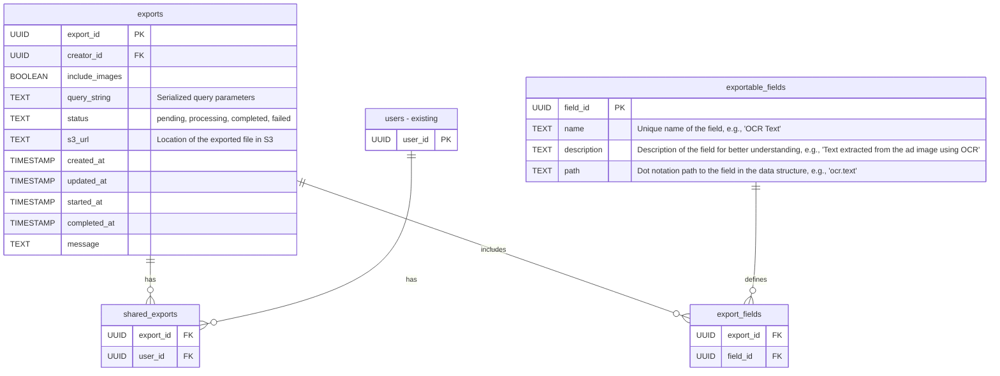

# Server-side Data Export

At the time of writing (07/01/2026), the Australian Ad Observatory provides the ability to export data through its web interface. The data fetching is performed on the client side, where users can select specific parameters and download the data in CSV format.

There are certain limitations to this approach:
- **Performance**: This process involves the user's browser fetching and processing the data via API calls, which can be slow and resource-intensive, especially for large datasets.
- **User Experience**: During the data export process, the user interface may become unresponsive, leading to a poor user experience. Additionally, the user must remain on the page until the export is complete, which can be inconvenient.
- **Scalability**: As the volume of data grows, client-side exports may become increasingly impractical, and there is a risk of timeouts or failures during the export process.

## Requirements

To address these limitations, consider implementing a server-side data export feature, with the following requirements:
- **Asynchronous Processing**: The export process should be handled on the server side, allowing users to initiate an export request and monitor its progress on a separate status page.
- **Job Queue**: 
  - Utilise a job queue system (e.g., AWS SQS) to manage export requests, ensuring that the server can handle multiple requests efficiently without overloading.
  - Requests should be processed on the server, generating the export files in a background worker (e.g., an AWS Lambda function, or an EC2 instance running a worker process).
  - Implement retry logic for failed export jobs, with a maximum number of retries before marking the job as failed.
- **Export Endpoints**: 
  - Create CRUD endpoints: `POST /exports` endpoints to initiate an export job, `GET /exports?user_id={user_id}` to list all exports for a user (created by them, or shared with them), `GET /exports/{export_id}` to check the status of a specific export job.
  - `DELETE /exports/{export_id}` to allow users to delete their export jobs and associated files.
  - `POST /exports/{export_id}/share` to share the export with other users by adding their user IDs to the export's access list.
  - `POST /exports/{export_id}/unshare` to remove users from the export's access list.
  - All endpoints should require user authentication.
- **Storage**: 
  - Store the exported files in a scalable storage solution (e.g., AWS S3) and provide secure access for users to download their files. 
  - Export status should be tracked in a database (e.g., PostgreSQL) with fields for creator ID, export parameters, status (pending, processing, completed, failed), file location, and timestamps.
- **Expiration and Cleanup**: 
  - Use lifecycle policies to automatically delete exported files after a certain period (e.g., 7 days) to manage storage costs and maintain data privacy.
- **Self-Service**: 
  - Create a user interface that allows users to initiate exports, view the status of their export jobs, and download completed files without needing to contact support.
  - (Optional) For users with email addresses, an email notification can be sent when the export is complete, including a link to download the file. Since there are not many users with email addresses, this is not a priority.

This feature is quite similar to how Facebook or Google Takeout handle data exports for their users, where users can request their data and receive it in a downloadable format after some processing time. This feature will supersede the existing client-side export functionality, providing a more robust and user-friendly experience.

## Data Structure

Below are example data structures (as JSON) involved in the server-side export process.

**Export Job Request (`POST /exports`)**

```json
{
   // The query to narrow down the data to be exported, compatible with existing API query structure
   "query": {
   "method": "OBSERVER_ID_CONTAINS",
   "args": ["123456"] // Example activation code
   },
   // Whether to include the images associated with the ads
   "include_images": true,
   "fields": ["observation_id", "observer_id", "ocr.x", "ocr.y", "ocr.text", "ocr.confidence", "attributes.starred.value", "tags", "classifications"] // Optional: specify fields to include. If omitted, include only "default" fields.
}
```

**Export Job Status (`GET /exports/{export_id}`)**

```json
{
  "export_id": "export_67890",
  "creator_id": "user_12345",
  // immutable export parameters
  "export_parameters": {
    "query": {
      "method": "OBSERVER_ID_CONTAINS",
      "args": ["123456"]
    },
    "include_images": true,
    "fields": ["observation_id", "observer_id", "ocr.x", "ocr.y", "ocr.text", "ocr.confidence", "attributes.starred.value", "tags", "classifications"]
  },
  "shared_with": ["user_67890", "user_54321"], // List of user IDs with whom the export is shared
  "status": "processing", // or "pending", "completed", "failed"
  "url": null, // After completion, contains a presigned S3 URL for downloading the exported file
  "created_at": "2026-01-07T12:00:00Z",
  "updated_at": "2026-01-07T12:05:00Z",
  "started_at": "2026-01-07T12:01:00Z", // Will be populated when the export starts processing
  "completed_at": null, // Will be populated when the export is completed
  "message": null // Will contain error message if the export fails
}
```

**Export Job List (`GET /exports?user_id={user_id}`)**

Should be a list of export job status objects as defined above.

**Export Share Request (`POST /exports/{export_id}/share`)**

```json
{
  "user_ids": ["user_67890", "user_54321"] // List of user IDs to share the export with
}
```

**Export Unshare Request (`POST /exports/{export_id}/unshare`)**

```json
{
  "user_ids": ["user_67890"] // List of user IDs to remove access from the export
}
```

**Message Queue Payload**

```json
{
  "export_id": "export_67890",
  "creator_id": "user_12345",
  "export_parameters": {
    "query": {
      "method": "OBSERVER_ID_CONTAINS",
      "args": ["123456"]
    },
    "include_images": true,
    "fields": ["observation_id", "observer_id", "ocr.x", "ocr.y", "ocr.text", "ocr.confidence", "attributes.starred.value", "tags", "classifications"]
  },
  "attempt": 1, // Current attempt number for retry logic
  "max_retries": 3 // Maximum number of retries allowed
}
```

**Database Schema (PostgreSQL)**



This schema defines two tables: `exports` to store export job details and `shared_exports` to manage sharing relationships between exports and users. The `users` table is assumed to already exist in the system.

**Export File Storage**

Exported files should be stored in an AWS S3 bucket with the following structure:

```
s3://australian-ad-observatory-exports/outputs/{creator_id}_{export_id}_{timestamp}.zip
```

Where:
- `{creator_id}` is the ID of the user who initiated the export.
- `{export_id}` is the unique ID of the export job.
- `{timestamp}` is the time when the export was created, formatted as `YYYYMMDDHHMMSS`.

**Export Folder Structure**

When exporting data, especially when including images, the exported ZIP file should have the following structure:

```
/export_{export_id}.zip/
    all_data.csv
    export_details.json
    /ads/
        {observation_id_1}/
            image_1.jpg
            image_2.jpg
            data.json
        {observation_id_2}/
            image_1.jpg
            image_2.jpg
            data.json
        ...
```

Where:
- `all_data.csv`: A CSV file containing all exported data based on the user's selected parameters.
- `export_details.json`: A JSON file summarizing the export parameters, including the query used, fields included, whether images were included, and timestamps. Should look similar to the Export Job Status structure (without the URL and status fields).
- `/ads/`: A directory containing subdirectories for each ad included in the export.
- `{observation_id_n}/`: A directory for each ad, containing its associated images and a JSON file with the ad's metadata.
  - `image_n.jpg`: The image files associated with the ad.
  - `data.json`: A JSON file containing metadata for the ad, including all fields requested by the user.

## Infrastructure

Currently, the Australian Ad Observatory is hosted on AWS. The following services are already in use:
- **API Gateway**: For handling API requests.
- **Lambda**: For backend logic and processing.
- **RDS (PostgreSQL)**: For relational data storage.
- **S3**: For file storage (ad images and raw data).

The following additional services will need to be integrated:
- **SQS**: For managing the export job queue.
- **New S3 Bucket**: A dedicated S3 bucket for storing exported files, with appropriate lifecycle policies for automatic deletion after a set period (e.g., 7 days).
- **Lambda Durable Functions or EC2 Worker**: For processing export jobs from the SQS queue, generating export files, and uploading them to S3. [Reference](https://docs.aws.amazon.com/lambda/latest/dg/durable-invoking-esm.html)

Of course the configuration file will need to be updated to include the new services and their parameters, e.g.,

```ini
[EXPORT]
S3_BUCKET = australian-ad-observatory-exports
SQS_QUEUE_URL = https://sqs.{region}.amazonaws.com/{account_id}/export-queue
MAX_RETRIES = 3
EXPORT_EXPIRATION_DAYS = 7

; Other existings configurations
```

## Implementation Steps

### [Completed] Milestone 1: Database Schema

Implement the database schema changes to support export job tracking and sharing functionality. This includes creating the `exports`, `shared_exports`, `exportable_fields`, and `export_fields` tables as defined in the Data Structure section. Ensure that appropriate indexes and foreign key constraints are in place for data integrity and performance.

As a starting point, populate the `exportable_fields` table with a predefined list of fields that users can choose to include in their exports. This will be based on the following sample RDO:

```json
{
   "version": 2.0,
   "is_user_disabled": false,
   "observer": {
      "uuid": "48734387-5226-4e96-b97c-2d0747a99898",
      "demographic_characteristics": null,
      "joined_at": 1759582902.322,
      "device_dimensions": {
         "w": "1080",
         "h": "2400"
      },
      "device": {
         "dimensions": {
            "w": "1080",
            "h": "2400"
         },
         "os_version": "5.15.148-android14-11-ge358535bc9c0-ab12324526(12470370)",
         "api_level": 35,
         "device": "akita",
         "model": "Pixel 8a (akita)"
      }
   },
   "observation": {
      "uuid": "1759583019000.e60b8866-daa0-40de-821b-80d8863db2b6",
      "observed_on_device_at": 1759583019,
      "observed_on_device_at_decimal": 1759583019.0,
      "submitted_from_device_at": 1759583893,
      "platform": "INSTAGRAM",
      "ad_format": "FEED_BASED",
      "exposure": "unknown",
      "media_bounds": [],
      "whitespace_derived_color": "unknown",
      "whitespace_derived_signature": [],
      "ad_dimensions": {
         "w": "1080",
         "h": "2400"
      },
      "video": {
         "fps": 60.0,
         "n_frames": 540,
         "n_seconds": 9.614
      },
      "keyframes": [
         {
            "observed_at": 1759583011,
            "y_offset": 0,
            "screenshot_cropped": "48734387-5226-4e96-b97c-2d0747a99898/temp-v2/eba33a79-58c4-4563-b746-942eb2feca4f/480.jpg",
            "frame": "48734387-5226-4e96-b97c-2d0747a99898/temp-v2/eba33a79-58c4-4563-b746-942eb2feca4f/480.jpg",
            "ocr_data": [
               {
                  "x": 147,
                  "y": 25,
                  "w": 80,
                  "h": 38,
                  "text": "Raiz",
                  "confidence": 0.9999802112579346
               },
               {
                  "x": 57,
                  "y": 52,
                  "w": 57,
                  "h": 28,
                  "text": "raiz",
                  "confidence": 0.8789364695549011
               },
               {
                  "x": 144,
                  "y": 76,
                  "w": 169,
                  "h": 43,
                  "text": "Sponsored",
                  "confidence": 0.9998557264331304
               },
               {
                  "x": 981,
                  "y": 169,
                  "w": 80,
                  "h": 36,
                  "text": "0221",
                  "confidence": 0.47647157311439514
               },
               {
                  "x": 195,
                  "y": 288,
                  "w": 692,
                  "h": 85,
                  "text": "POV: What would you lell",
                  "confidence": 0.6000806468803948
               },
               {
                  "x": 236,
                  "y": 355,
                  "w": 605,
                  "h": 85,
                  "text": "your 20 year old self?",
                  "confidence": 0.9328830237204218
               },
               {
                  "x": 37,
                  "y": 1527,
                  "w": 196,
                  "h": 38,
                  "text": "Install now",
                  "confidence": 0.9537361107954198
               },
               {
                  "x": 111,
                  "y": 1643,
                  "w": 36,
                  "h": 38,
                  "text": "4",
                  "confidence": 0.8642759009917108
               },
               {
                  "x": 164,
                  "y": 1624,
                  "w": 112,
                  "h": 76,
                  "text": "Q1",
                  "confidence": 0.5975694933477976
               },
               {
                  "x": 32,
                  "y": 1728,
                  "w": 698,
                  "h": 48,
                  "text": "Paid for by Raiz Invest Australia Limited",
                  "confidence": 0.9247916412987603
               },
               {
                  "x": 32,
                  "y": 1783,
                  "w": 960,
                  "h": 54,
                  "text": "Ever thought your spare change could build your future?",
                  "confidence": 0.8554312604275939
               },
               {
                  "x": 32,
                  "y": 1832,
                  "w": 368,
                  "h": 52,
                  "text": "With Raiz, every card",
                  "confidence": 0.9826911258792588
               },
               {
                  "x": 462,
                  "y": 1836,
                  "w": 458,
                  "h": 48,
                  "text": "rounds up to the nearest d",
                  "confidence": 0.9427941822128185
               },
               {
                  "x": 944,
                  "y": 1844,
                  "w": 92,
                  "h": 30,
                  "text": "more",
                  "confidence": 0.8420790433883667
               },
               {
                  "x": 400,
                  "y": 1835,
                  "w": 67,
                  "h": 50,
                  "text": "tap",
                  "confidence": 0.9999947004371946
               }
            ]
         }
      ]
   },
   "enrichment": {
      "ccl_v2": {},
      "ccl": {},
      "meta_adlibrary_scrape": {
         "comparisons": {
            "ocr": [],
            "image": {
               "comparisons": [],
               "ad_scrape_sources": {}
            },
            "video": {
               "comparisons": [],
               "ad_scrape_sources": {}
            }
         },
         "candidates": [],
         "rankings": [],
         "scraped_at": 0,
         "reference": {
            "caller": {
               "observer_uuid": "unknown",
               "tentative_ad": "unknown"
            },
            "scrape": {
               "observer_uuid": "unknown",
               "tentative_ad": "unknown"
            }
         },
         "query": {
            "restitched_image_key": "unknown",
            "value": "unknown",
            "confidence": 0.0
         }
      },
      "media": {}
   },
   "media": [
      "48734387-5226-4e96-b97c-2d0747a99898/temp-v2/eba33a79-58c4-4563-b746-942eb2feca4f/480.jpg"
   ]
}
```

The initial set of exportable fields could include (but is not limited to) the following examples:

```json
[
  {
    "id": "auto-generated", // Should be auto-generated as part of the up() migration
    "name": "Observer UUID",
    "description": "Unique identifier for the observer who submitted the ad",
    "path": "observer.uuid",
  },
  {
    "id": "auto-generated",
    "name": "Observer Device Model",
    "description": "Model of the device used by the observer",
    "path": "observer.device.model",
  },
  // Include device dimensions, os version, api level, device
  // and observation platform, ad format, observed on device at, keyframes, ocr data
]
```

### [Completed] Milestone 2: Export Job Worker

This is the key component that will process export jobs asynchronously. The worker will:
- Poll the SQS queue for new export job messages.
- For each message, retrieve the export job details from the database.
- Execute the export logic based on the provided parameters (query, fields, include images).
- Generate the export files (CSV, JSON, HTML report, images) and package them into a ZIP file.
- Upload the ZIP file to the designated S3 bucket.
- Update the export job status in the database (processing, completed, failed) and store the S3 URL.
- Implement retry logic for failed jobs, creating new messages in the queue up to the maximum number of retries.

The worker is implemented in a different repository, to keep the concerns separated. The downside, however, is that code duplication may occur if there are shared utilities or models between the main API and the worker.

### Milestone 3: API Endpoints

Develop the required API endpoints for initiating export jobs, checking their status, listing exports, deleting exports, and managing sharing functionality. Ensure proper authentication and authorization mechanisms are in place. Each endpoint should be tested for expected functionality.

This step will also involve integrating the export job processing logic with the S3 bucket, SQS queue, Lambda functions, ensuring that when an export job is initiated via the API, it is correctly queued and processed in the background. Error handling and retry logic should be implemented as specified, where failed jobs are retried (creating new messages in the queue) up to the maximum number of retries before being marked as failed.

### Milestone 4: User Interface

Create a user interface that allows users to initiate exports, monitor their status, and download completed files. Ensure the UI is user-friendly and provides clear feedback during the export process. The interface should occasionally poll the export status endpoint to update users on the progress of their exports.

The interface should include the following:

- **New pages**:
  - `/exports`: A page listing all export jobs for the logged-in user, with options to initiate new exports, view status, download files, and manage sharing. This page should display each export as a card with relevant information (status, created at, actions).
  - `/exports/new`: A page for initiating a new export job, allowing users to select parameters such as query, fields, and whether to include images.
- **Components**:
  - Export Job List: A component to display a list of export jobs with their statuses and actions.
  - Export Job Form: A component for users to specify export parameters and initiate a new export job.
  - Export Job Detail: A component to show detailed information about a specific export job, including sharing options.