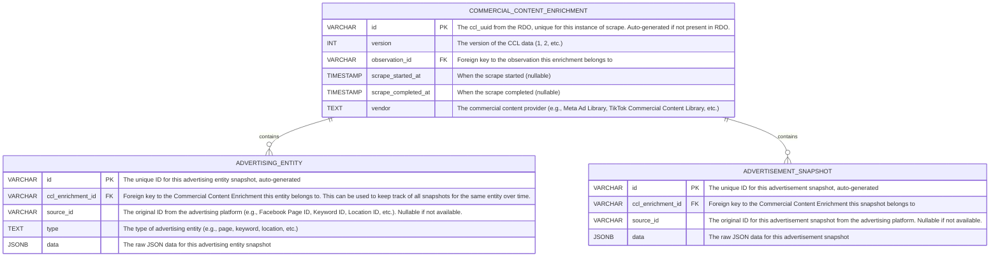

# Australian Ad Observatory - Commercial Content Library Enrichment Visualisation

> Glossary:
>
> - CCL: Commercial Content Library
> - RDO: Rich Data Object

> Samples:
>
> - 723de9f7-e79a-4447-a9b9-1021b98b9850/1759531158620.4ad4d3ad-1ccb-4b29-9a42-b61803334cc2

This document breakdowns the tasks involved in bringing the Commercial Content Library Enrichment packaged alongside the Advertisement Rich Data Objects to the Australian Ad Observatory Dashboard. Currently, the CCL is a set of JSON files obtained from various commercial content providers (for now, only Meta), which contains metadata about the ad observed by MOAT. RDOs are stored in an S3 bucket and are regularly updated with CCL content. The goal of this task is to visualise this data in a meaningful way on the Australian Ad Observatory Dashboard, while anticipating some future requirements:

- Adding more commercial content providers (e.g., TikTok, YouTube, etc).
- Making the CCL data searchable, filterable and exportable for consistency with existing features.

The tasks are broken down into several milestones, each with its own deliverables and estimated timeframes.

## [Completed] Milestone 1: Data Ingestion and Storage for "Clean RDOs"

**Background**: In the current workflow, the API returns whole RDOs, which contain both the ad data and the CCL metadata. The CCL version 2 data is much more complex than version 1, with a more nested structure, additional fields, data duplications, and contains metadata that is not directly relevant to the dashboard experience.

**Goal**: Create a robust data ingestion pipeline that extracts, transforms and loads the CCL data from the RDOs into a more structured and queryable format, likely a combination of relational and object storage. This will integrate with the existing PostgreSQL database storage used by the dashboard. This will use a message-driven architecture (powered by AWS SQS), with a service worker (likely an instance on Nectar) handling the ingestion process. Processing CCL version 2 data is required; backwards compatibility with CCL v1 is not required. Prefer designing the parser architecture using dependency injection and a common interface (for example, Factory or Strategy patterns) so parsers for other vendors or CCL versions can be added later without changing the core ingestion flow. Going forward, the current RDOs will be treated as "raw data", and this layer will provide type-safe "clean RDOs" for the API to consume and serve to the dashboard.

Additionally, this milestone should eliminate the reliant on S3 for RDO retrieval during API requests to improve performance. Frequent read operations on S3 can be slow, so having the CCL data stored in a database will allow for faster querying and retrieval.

**Estimate**: 1.5 weeks

**Deliverables**:

- A documented data schema (in the form of an ERD and TypeScript types) for the CCL data.
- SQS queue setup and linked to RDO updates events in S3.
- Service worker code that processes RDOs, extracts CCL data, transforms it to the new schema and stores it in the PostgreSQL database.
- A script to process existing RDOs to backfill the CCL data in the new storage.

### Execution

For this particular task, we are interested in extracting the CCL metadata from the RDOs and storing them in a more structured format. Observing the sample RDO structure, there are two major pieces of CCL data:

- `enrichment.ccl_v2.<ccl_uuid>.name_check_output.output.data.ad_library_main.typehead_suggestions`, which shows the possible advertising entities associated with the ad, which could be the pages, keywords or locations (all lists).
- `enrichment.ccl_v2.<ccl_uuid>.scrape_output.response_interpreted.json_interpreted`, which contains a list of ad "snapshots" with various metadata fields. These snapshots represent the "original ad" on the advertising platform, to distinguish them from the "observed ad" that MOAT captured on the mobile app.

Since the data are scraped, the above entities are actually "snapshots" of the advertising entities at the time of scraping, so there could be multiple snapshots for the same advertising entity (e.g., the same Facebook page). Therefore it would be beneficial to store the timestamps of these snapshots for possible historical analysis.

Generalising from here, there are three main entities to store:



The `data` fields will store the raw JSON data for each entity (advertising entity and advertisement snapshot) to allow for flexibility in querying and future-proofing against changes in the CCL data structure, but it is assumed and expected that the core fields (e.g., `source_id`, `type`, etc.) will be quite consistently present across different commercial content providers.

In general, the ingestion pipeline will follow these steps:

1. **RDO Retrieval**: The service worker listens to the SQS queue for new RDO events. When a new RDO is detected, it retrieves the RDO from the S3 bucket.
2. **CCL Extraction**:
   1. Identify the CCL version (1, 2, etc.) from the RDO structure (including the presence of the `version: 2` field, as well as the existence of `ccl_v2`, `ccl` or `meta_adlibrary_scrape` fields).
   2. Extract the relevant CCL data based on the identified version.
   3. Create media mapping from the original URLs to the stored S3 URLs for media assets (images, videos, etc.) if applicable, and update the extracted data accordingly.
   4. Transform the extracted data into the new schema.
3. **Data Storage**: Store the transformed data into the PostgreSQL database. This step should also be idempotent, so that re-processing the same RDO does not create duplicate entries in the database. This can be achieved by using unique constraints on the relevant fields (e.g., `ccl_uuid` for `Commercial Content Enrichment` if present, or a combination of `observation_id` and `scrape_started_at`).

Processing existing RDOs can be done via a separate script that iterates through all RDOs in the S3 bucket, applying the same extraction and transformation logic as above.

The RDOs are current stored at `s3://fta-mobile-observations-v2/<observer_id>/rdo/<timestamp>.<observation_id>/output.json`. For example:`s3://fta-mobile-observations-v2/01d18415-729f-4496-911d-c5099ffbaf0b/rdo/1758667440335.f5ba7902-f5a3-409e-a5a1-b10c228aca08/output.json`, where `01d18415-729f-4496-911d-c5099ffbaf0b` is the observer ID for MOAT, `1758667440335` is the timestamp in milliseconds, and `f5ba7902-f5a3-409e-a5a1-b10c228aca08` is the observation ID.

The media assets (images, videos, etc.) referenced in the `json_interpreted` field are currently stored in another bucket: `s3://fta-mobile-observations-v2-ccl/outputs/meta_adlibrary/meta_adlibrary_scrapes/<ccl_uuid>/mass_download/mass_download_result.json`, where `<ccl_uuid>` is the unique identifier for the CCL scrape. The `mass_download_result.json` file contains the mapping of original URLs to the stored S3 URLs, in the following format:

```json
{
  "outlinks": {
    "40b4be4d-b31d-4e4f-b2d4-ce38bb59228d": {
      "vendor": "meta_adlibrary",
      "url": "https://video-syd2-1.xx.fbcdn.net/v/t42.1790-2/461424092_860297592859812_2583891266042168306_n.?_nc_cat=102&ccb=1-7&_nc_sid=c53f8f&_nc_ohc=bhIT8aAGg98Q7kNvwEifuDC&_nc_oc=AdmWQiZDr-92McpyNR2gmGuT-E0yBiBc3hNaEA108DrpG9swgtb90KKtCtMhvWwwlY&_nc_zt=28&_nc_ht=video-syd2-1.xx&_nc_gid=3GaXPGaWY6aXwkEtNAHssg&oh=00_Afh1FP5DEMqjLR3INmEaNPQV11IIZ7_m4EUIWmcW8UER2A&oe=69120D11",
      "scrape_uuid": "000389a3-5992-4a07-b69c-7e5658b4aa31",
      "outlink_uuid": "40b4be4d-b31d-4e4f-b2d4-ce38bb59228d",
      "content_type": "mp4",
      "attempted": true,
      "passed": true
    }
  }
}
```

Where "40b4be4d-b31d-4e4f-b2d4-ce38bb59228d" is the unique ID for the outlink, and the `url` field contains the "original" temporary URL. Using this mapping, the path of the relevant media asset is:

`s3://fta-mobile-observations-v2-ccl/outputs/meta_adlibrary/meta_adlibrary_scrapes/<ccl_uuid>/mass_download/<outlink_uuid>.<content_type>`

For example, for the above outlink, the path would be:

`s3://fta-mobile-observations-v2-ccl/outputs/meta_adlibrary/meta_adlibrary_scrapes/000389a3-5992-4a07-b69c-7e5658b4aa31/mass_download/40b4be4d-b31d-4e4f-b2d4-ce38bb59228d.mp4`

When processing the `json_interpreted` data, any media URLs found should be replaced with the corresponding S3 URIs. The API should generate pre-signed URLs for these S3 URIs when serving the data to the dashboard.

Additionally, to enable querying over OpenSearch, the data will also be transformed to a fixed schema with canonical fields extracted from the raw JSON data. The schema is as follows:

```typescript
type PrimitiveOrArray = string | number | boolean | null | (string | number | boolean | null)[];

type QueryableDataObject = {
  id: string; // Unique identifier for this Observation, which should just be the observation uuid
  user_settings: {
    key: string;
    value: string | number | boolean | null;
  }[];
  observer: {
    uuid: string;
    joined_at_ms: number; // Timestamp (ms) when the observer was registered
    device: {
      dimensions: {
        width: number;
        height: number;
      };
      os_version: string;
      api_level: number;
      model: string;
      code_name: string; // maps from observer.device.device
    };
    survey_data: {
      respondent_id: string;
      // Use a key-value pair structure for survey responses to allow for flexible and dynamic survey designs, rather than a fixed schema. The keys can be the question identifiers, and the values can be the respondent's answers.
      // This also reduces the number of fields needed in OpenSearch, as we don't need to create a separate field for each survey question, which may vary widely between different surveys and over time.
      responses: {
        key: string; // The question identifier (e.g., "age_range", "gender", "location", "device_usage", etc.)
        value: PrimitiveOrArray; // The respondent's answer to the question
      }[]
    }
  };
  observation: {
    uuid: string; // Should not include the timestamp prefix
    observed_at_ms: number; // Timestamp (ms) when the ad was observed on device
    submitted_at_ms: number; // Timestamp (ms) when the observation was submitted from device
    platform: string; // e.g., "FACEBOOK", "INSTAGRAM", "TIKTOK", etc.
    ad_format: string; // e.g., "REEL_BASED", "STORY_BASED", etc.
    exposure: string; // seems to be always 'unknown' for now
    video_metadata: {
      fps: number | null;
      frame_count: number | null;
      duration_seconds: number | null;
      dimensions: {
        width: number | null;
        height: number | null;
      };
    };
    keyframes: {
      frame_number: number; // The index of the keyframe in the video
      observed_at_ms: number; // Timestamp (ms) when the keyframe was captured
      ocr_data: {
        text: string; // The text extracted from the keyframe using OCR
        confidence: number; // Confidence score for the OCR text extraction (0-1)
        bounding_box: {
          x: number; // The x-coordinate of the top-left corner of the bounding box
          y: number; // The y-coordinate of the top-left corner of the bounding box
          width: number; // The width of the bounding box
          height: number; // The height of the bounding box
        };
      }[]
    }[];
  };
  enrichments: {
    ccl: {
      uuid: string; // The ccl_uuid for this enrichment
      version: number; // The version of the CCL data (1, 2, etc.)
      vendor: string; // The commercial content provider (e.g., "META_ADLIBRARY", "TIKTOK_CCL", etc.)
      advertising_entities: {
        source_id: string | null; // The original ID from the advertising platform (e.g., Facebook Page ID, Keyword ID, Location ID, etc.). Nullable if not available.
        type: string; // The type of advertising entity (e.g., "page", "keyword", "location", etc.)
        name: string | null; // The name of the advertising entity (e.g., page name, keyword text, location name, etc.). Nullable if not available.
        properties: {
          key: string; // All other properties of the advertising entity (e.g., name, category, likes, verification status, etc.)
          value: PrimitiveOrArray;
        }[];
      }[];
      advertisement_snapshots: {
        source_id: string | null; // The original ID for this advertisement snapshot from the advertising platform (e.g., ad_archive_id). Nullable if not available.
        text_content: string | null; // The text content of the ad, extracted and merged from various fields (e.g., caption, body.text, etc.) to allow for easier searching and indexing. Nullable if not available.
        properties: {
          key: string; // All properties of the advertisement snapshot (e.g., caption, cta_text, display_format, link_url, page_name, page_like_count, etc.)
          value: PrimitiveOrArray;
        }[];
      }[];
    }[];
  };
}
```

All `key` should use the dot notation to represent the original path in the raw JSON data (e.g., `page_result.name`, `snapshot.caption`, `snapshot.body.text`, etc.) to allow for easier tracing back to the original data structure when needed. This also allows for more flexible querying in OpenSearch, as we can query for specific properties without needing to define a fixed schema for the advertisement snapshots, which can vary widely between different commercial content providers and over time.

The `text_content` field in the `advertisement_snapshots` is a new field that concatenates and merges all relevant text fields from the snapshot data (e.g., caption, body.text, link_description, title, etc.) into a single string to allow for easier searching and indexing in OpenSearch. This is because the original snapshot data can have text content spread across multiple fields, and having a consolidated `text_content` field will simplify the search experience on the dashboard.

Note that the `QueryableDataObject` is used for OpenSearch indexing only, and the API endpoints will still serve the original raw JSON data from the `data` columns in the database to allow for maximum flexibility in the dashboard visualisation layer.

---

## Additional Considerations

- **Acceptance criteria for each milestone** (tests, performance targets, and sign-off)

Milestone 1 is considered complete when: (1) the data ingestion pipeline is implemented and can process new RDOs in near real-time (within a few minutes of RDO availability); (2) the backfill script can process existing RDOs and populate the database without errors; (3) the data schema is documented and reviewed; and (4) basic tests are in place to ensure data integrity during ingestion.

- **Canonical field mapping** — the following fields MUST be canonicalized (stored as separate DB columns) and example types/values; anything else found in a similar format to the attached sample should be stored in JSONB in the relevant table (`advertising_entity.data`, `advertisement_snapshot.data`, or a `data` column on the enrichment record)

| Field (DB column)                                 | Type                 | JSON path in RDO                                                                                                             | Example / Notes                                        |
| ------------------------------------------------- | -------------------- | ---------------------------------------------------------------------------------------------------------------------------- | ------------------------------------------------------ |
| `CommercialContentEnrichment.id`                  | VARCHAR              | `enrichment["ccl_v2"]["<ccl_uuid>"]["uuid"]`                                                                                 | `"000389a3-5992-4a07-b69c-7e5658b4aa31"`               |
| `CommercialContentEnrichment.observation_id`      | VARCHAR              | `observation["uuid"]`                                                                                                        | `"1759531158620.4ad4d3ad-1ccb-4b29-9a42-b61803334cc2"` |
| `CommercialContentEnrichment.version`             | INT                  | `version`                                                                                                                    | `2`                                                    |
| `CommercialContentEnrichment.platform`            | VARCHAR              | `enrichment["ccl_v2"]["<ccl_uuid>"]["platform"]` or `observation["platform"]`                                                | `"FACEBOOK"`                                           |
| `CommercialContentEnrichment.ad_type`             | VARCHAR              | `enrichment["ccl_v2"]["<ccl_uuid>"]["ad_type"]` or `observation["ad_format"]`                                                | `"REEL_BASED"`                                         |
| `CommercialContentEnrichment.vendor`              | VARCHAR              | `enrichment["ccl_v2"]["<ccl_uuid>"]["vendor"]`                                                                               | `"META_ADLIBRARY"`                                     |
| `CommercialContentEnrichment.scrape_started_at`   | TIMESTAMP            | `enrichment["ccl_v2"]["<ccl_uuid>"]["timestamp"]`                                                                            | `1762408877873`                                        |
| `CommercialContentEnrichment.scrape_completed_at` | TIMESTAMP (nullable) | `enrichment["ccl_v2"]["<ccl_uuid>"]["scrape_completed_at"]` or fallback to `enrichment["ccl_v2"]["<ccl_uuid>"]["timestamp"]` | `1762408878011`                                        |
| `AdvertisingEntity.source_id`                     | VARCHAR (nullable)   | vendor entity id when present (e.g., `page_result["page_id"]`)                                                               | `"106208145902863"`                                    |
| `AdvertisingEntity.type`                          | VARCHAR              | inferred from entity (e.g., `page`, `keyword`, `location`) — `page_results` → `page`                                         | `"page"`                                               |
| `AdvertisementSnapshot.source_id`                 | VARCHAR (nullable)   | vendor snapshot id (e.g., `snapshot["ad_archive_id"]` or `snapshot["ad_id"]`)                                                | `"1662132171399390"`                                   |

> **Note:** The JSON paths and examples above are specific to **META_ADLIBRARY** (the attached sample) and CCL version 2 of RDO version 2. Implement a platform/version-specific parser architecture using dependency injection and a common interface (for example, via Factory or Strategy patterns) so dedicated parsers for other vendors or CCL versions can be added later without changing the core ingestion flow.

**Example instances as JSON (derived from `./assets/rdo_v2_ccl_v2_4ad4d3ad-1ccb-4b29-9a42-b61803334cc2.json`):**

CommercialContentEnrichment (DB record example):
```json
{
  "id": "000389a3-5992-4a07-b69c-7e5658b4aa31",
  "observation_id": "1759531158620.4ad4d3ad-1ccb-4b29-9a42-b61803334cc2",
  "version": 2,
  "platform": "FACEBOOK",
  "ad_type": "REEL_BASED",
  "vendor": "META_ADLIBRARY",
  "scrape_started_at": 1762408877873,
  "scrape_completed_at": 1762408878011
}
```

How to extract CommercialContentEnrichment from the RDO:
- Locate the top-level `enrichment.ccl_v2` object and iterate its keys to find each `<ccl_uuid>` entry (e.g., `000389a3-5992-4a07-b69c-7e5658b4aa31`).
- For each `<ccl_uuid>` node, map fields:
  - `id` ← `enrichment["ccl_v2"]["<ccl_uuid>"]["uuid"]`
  - `vendor` ← `enrichment["ccl_v2"]["<ccl_uuid>"]["vendor"]`
  - `platform` ← `enrichment["ccl_v2"]["<ccl_uuid>"]["platform"]` (fallback to `observation["platform"]` if missing)
  - `ad_type` ← `enrichment["ccl_v2"]["<ccl_uuid>"]["ad_type"]` (fallback to `observation["ad_format"]`)
  - `scrape_started_at` ← `enrichment["ccl_v2"]["<ccl_uuid>"]["timestamp"]` (convert epoch float seconds to DB TIMESTAMP)
  - `scrape_completed_at` ← `enrichment["ccl_v2"]["<ccl_uuid>"]["scrape_completed_at"]` if present; otherwise fall back to `scrape_started_at`.
  - `observation_id` ← `observation["uuid"]` (from the same RDO)
- If `enrichment["ccl_v2"]["<ccl_uuid>"]["uuid"]` is missing, generate a deterministic id (e.g., hash of `observation_id` + `scrape_started_at`) and record provenance.

AdvertisingEntity (DB record example):
```json
{
  "id": "ae-0001",
  "ccl_enrichment_id": "000389a3-5992-4a07-b69c-7e5658b4aa31",
  "source_id": "106208145902863",
  "type": "page",
  "data": {
    "page_id": "106208145902863",
    "category": "Health & wellness website",
    "image_uri": "https://scontent-syd2-1.xx.fbcdn.net/v/t39.30808-1/362948134_10226443008802011_1058677315397632736_n.jpg?stp=dst-jpg_s200x200_tt6&_nc_cat=106&ccb=1-7&_nc_sid=418b77&_nc_ohc=w6wYvuttEbEQ7kNvwEK9lIR&_nc_oc=AdmX2R8lJbXKsBfFna307dxH_B4cBMD6c6HWD2FBg2vfHtRjRnXzvcfSbkYtZrsaqJI&_nc_zt=24&_nc_ht=scontent-syd2-1.xx&_nc_gid=WMmzWgelnPmIJ0pmXC2oAg&oh=00_AfiftgiQ2h_hGOX1WULrHYMtP9L-_TGDXWCSJc63Y7JF2Q&oe=6912178A",
    "likes": 5058,
    "verification": "NOT_VERIFIED",
    "name": "Kate Abott",
    "country": null,
    "entity_type": "PERSON_PROFILE",
    "ig_username": null,
    "ig_followers": null,
    "ig_verification": null,
    "page_alias": "",
    "page_is_deleted": false
  }
}
```

How to extract AdvertisingEntity records from the RDO:
- Primary sources to search (in order):
  1. `enrichment["ccl_v2"]["<ccl_uuid>"]["namecheck_output"]["output"]["data"]["ad_library_main"]["typeahead_suggestions"]` — examine arrays `page_results`, `keyword_results`, and `location_results`.
     - `page_results` entries are rich page/person objects (see example above) and should be mapped into `AdvertisingEntity` rows. For `page_results`, set `type` = `page` and ensure all vendor-provided fields (including `name` and `entity_type`) are included in `data`.
     - `keyword_results` and `location_results` can be mapped to `AdvertisingEntity` rows with `type` set to `keyword` or `location`, and `source_id` set to a vendor id when present (otherwise null); include all vendor fields in `data`.
  2. Fallback: `enrichment["ccl_v2"]["<ccl_uuid>"]["scrape_output"]["response_interpreted"]["json_interpreted"]` — scan for embedded entity-like objects (look for `page_id`, `id`, `name`, `entity_type`, etc.).
- For each discovered entity candidate (e.g., a `page_results` object):
  - `ccl_enrichment_id` ← parent `<ccl_uuid>`
  - `source_id` ← `page_result["page_id"]` (string) if present
  - `type` ← `page` for `page_results`, otherwise canonical values (`keyword`, `location`)
  - `data.name` ← `page_result["name"]` (ensure present in `data`)
  - `data.entity_type` ← `page_result["entity_type"]` (ensure present in `data`)
  - Other commonly useful fields to surface as columns when present: `image_uri`, `likes` (int), `verification`, `country`, `ig_username`, `ig_followers`, `page_alias`, `page_is_deleted`.
  - `data` ← store the full original entity object as JSONB (to preserve vendor fields not normalised)
- Uniqueness & deduplication:
  - Prefer `(ccl_enrichment_id, source_id)` when `source_id` exists.
  - If `source_id` is absent, compute a stable hash of the entity object (e.g., canonical JSON -> SHA256) and deduplicate using `(ccl_enrichment_id, entity_hash)`.
  - Multiple entities can share the same `source_id`, as long as their `ccl_enrichment_id` differs (i.e., different scrapes of the same entity over time).


AdvertisementSnapshot (DB record example):
```json
{
  "id": "snap-0001",
  "ccl_enrichment_id": "000389a3-5992-4a07-b69c-7e5658b4aa31",
  "source_id": "1662132171399390",
  "data": {
    "ad_archive_id": "1662132171399390",
    "collation_count": null,
    "collation_id": "1189500728894518",
    "page_id": "106208145902863",
    "snapshot": {
        "branded_content": null,
        "page_id": "106208145902863",
        "page_is_deleted": false,
        "page_profile_uri": "https://www.facebook.com/100095621491191/",
        "root_reshared_post": null,
        "byline": null,
        "disclaimer_label": null,
        "page_name": "Kate Abott",
        "page_profile_picture_url": "https://scontent-syd2-1.xx.fbcdn.net/v/t39.35426-6/469965540_3959186554358861_3902635646311648747_n.jpg?stp=dst-jpg_s60x60_tt6&_nc_cat=104&ccb=1-7&_nc_sid=c53f8f&_nc_ohc=2k9aJs5j_3sQ7kNvwFI16It&_nc_oc=AdmQSumAGuZOjrm-R_9fS9lpMoseydFzjs54upfa__oqwijXNaP8J7EreSSdxP6plEc&_nc_zt=14&_nc_ht=scontent-syd2-1.xx&_nc_gid=3GaXPGaWY6aXwkEtNAHssg&oh=00_AfhjYwcm6hYbBp6sA-Lu9klqLXxmzhb72u4RT94hiSSHxQ&oe=69120DC1",
        "event": null,
        "caption": "effecto.app",
        "cta_text": "Learn more",
        "cards": [],
        "body": {
          "text": "\"Like Duolingo for ADHD\" \u2b50\ufe0f\u2b50\ufe0f\u2b50\ufe0f\u2b50\ufe0f\u2b50\ufe0f\n\nBoost your focus with Effecto \u2013 the perfect app for ADHD management.\n\nFind customized strategies and skill-building help without the use of medication \ud83d\udcaa"
        },
        "cta_type": "LEARN_MORE",
        "display_format": "VIDEO",
        "link_description": null,
        "link_url": "https://effecto.app/start?lp=ad5&locale=EN_US",
        "images": [],
        "page_categories": [
          "Health & wellness website"
        ],
        "page_like_count": 4294,
        "title": "Rewire Your ADHD Brain & Unlock Your Potential",
        "videos": [
          {
              "video_hd_url": "https://video-syd2-1.xx.fbcdn.net/v/t42.1790-2/469744587_1969886746756400_4876023461626579434_n.?_nc_cat=101&ccb=1-7&_nc_sid=c53f8f&_nc_ohc=9z7h8NsM1wYQ7kNvwGrIZWv&_nc_oc=AdkSC60GqOhS7Iqy46a4L2BBy6D468N_iy9Qv3SYDYyrwj8O_6n9_xqTAWFzNCJF0mA&_nc_zt=28&_nc_ht=video-syd2-1.xx&_nc_gid=3GaXPGaWY6aXwkEtNAHssg&oh=00_AfhJvZBJQqgv_NHqaXmz1hzHVDyz_KCyspBjjKthc24J8w&oe=69120167",
              "video_preview_image_url": "https://scontent-syd2-1.xx.fbcdn.net/v/t39.35426-6/470148383_1260895791675539_2612970390680247599_n.jpg?_nc_cat=108&ccb=1-7&_nc_sid=c53f8f&_nc_ohc=251fY6g2IM0Q7kNvwGRoFXx&_nc_oc=Adk66bSUAVriedcZ3dodpnj4eXHNte8OfdfjWSGBYjbJBWyJnmoO0KqYnyjsRVgoVsA&_nc_zt=14&_nc_ht=scontent-syd2-1.xx&_nc_gid=3GaXPGaWY6aXwkEtNAHssg&oh=00_AfiErltoKCJvFEFWOmTvOBKdtXcG7qfYz-4lKgyQaEdUHw&oe=69122645",
              "video_sd_url": "https://video-syd2-1.xx.fbcdn.net/v/t42.1790-2/362813786_185958397650683_6980796558235567268_n.mp4?_nc_cat=101&ccb=1-7&_nc_sid=c53f8f&_nc_ohc=5uOSIW2xTrMQ7kNvwHiILAC&_nc_oc=AdlW7vPndUOFwjX9qnnUHswOf9T5gPhKFD90fbgrFHdvd_wAPoi6OjqxNb3dnep9dbc&_nc_zt=28&_nc_ht=video-syd2-1.xx&_nc_gid=3GaXPGaWY6aXwkEtNAHssg&oh=00_Afich_DowWHg6qTH7OvOwNzaqNASu-5ulegEBCv3hbvW5g&oe=6912091A",
              "watermarked_video_hd_url": "",
              "watermarked_video_sd_url": ""
          }
        ],
        "is_reshared": false,
        "extra_links": [],
        "extra_texts": [],
        "extra_images": [],
        "extra_videos": [],
        "country_iso_code": null,
        "brazil_tax_id": null,
        "additional_info": null,
        "ec_certificates": []
    },
    "is_active": false,
    "has_user_reported": false,
    "report_count": null,
    "menu_items": [],
    "state_media_run_label": null,
    "page_is_deleted": false,
    "page_name": "Kate Abott",
    "gated_type": "ELIGIBLE",
    "categories": [
        "UNKNOWN"
    ],
    "is_aaa_eligible": true,
    "contains_digital_created_media": false,
    "reach_estimate": null,
    "currency": "",
    "spend": null,
    "impressions_with_index": {
        "impressions_text": null,
        "impressions_index": -1
    },
    "end_date": 1738137600,
    "publisher_platform": [
        "FACEBOOK",
        "INSTAGRAM",
        "AUDIENCE_NETWORK",
        "MESSENGER"
    ],
    "start_date": 1735545600,
    "contains_sensitive_content": false,
    "total_active_time": null,
    "regional_regulation_data": {
        "finserv": {
          "is_deemed_finserv": false,
          "is_limited_delivery": false
        },
        "tw_anti_scam": {
          "is_limited_delivery": false
        }
    },
    "hide_data_status": "NONE",
    "fev_info": null,
    "ad_id": null,
    "targeted_or_reached_countries": []
  }
}
```

How to extract AdvertisementSnapshot records from the RDO:
- Locate snapshots at `enrichment["ccl_v2"]["<ccl_uuid>"]["scrape_output"]["response_interpreted"]["json_interpreted"]` — this is typically an array of snapshot objects (fall back to other scrape outputs if absent).
- For each snapshot object (example structure shown above):
  - `ccl_enrichment_id` ← parent `<ccl_uuid>`
  - `source_id` ← prefer `ad_archive_id` or `ad_id` (e.g., `snapshot["ad_archive_id"]` or `snapshot["ad_id"]`), nullable if absent
  - The entire snapshot object should be stored in `data` JSONB to preserve all fields.
- Uniqueness & deduplication:
  - Prefer unique constraint `(ccl_enrichment_id, source_id)` when `source_id` exists.
  - Otherwise, deduplicate using `(ccl_enrichment_id, hash_of_snapshot_json)` or `(ccl_enrichment_id, snapshot_timestamp)` where possible.
  - If multiple snapshots share `source_id` but have different `snapshot_timestamp`s, insert them as distinct snapshot records (history preserved).
- Backfill & performance notes:
  - When running backfill, load `mass_download_result.json` per `ccl_uuid` once and reuse mappings; perform media matching in-memory to avoid repeated S3 reads.
  - If the mapped S3 object does not exist (e.g., `passed` = false), still record the intended `s3_path` and `passed` flag; consumers should handle missing objects gracefully.

The above applies to version 2 of the CCL enrichment data. Version 1 is legacy and supporting it is optional; if v1 support is required (for example, as part of a backfill), implement a dedicated parser that conforms to the same parser interface and registers via dependency injection so it can plug into the core ingestion flow without changes. The general principles of extraction, transformation and storage remain the same.

- **SQS event producer and message schema**

Using S3 event → SQS (simple)** — S3 event notifications deliver the native S3 event JSON to the ingestion queue. The ingestion worker is responsible for GETting the full RDO, detecting enrichment(s), and performing the extraction/parsing. This keeps the system simple and avoids an extra moving part (a pre-transformer Lambda) for now.

**Message contents & attributes (what to expect in S3 events / recommended attributes to add if publishing custom messages)**

- S3 event records include `s3.bucket.name`, `s3.object.key`, and `s3.object.etag` (useful for dedupe).

**Queue type**
- Use a **Standard** queue (selected): it provides high throughput and at-least-once delivery. Ordering is not required for our ingestion flow and workers should implement idempotency to handle duplicate deliveries.

**Deduplication & idempotency (worker responsibilities)**
- The ingestion worker must compute a stable `dedupe_key` from the S3 event or RDO content and use it to ensure idempotent processing. Recommended strategies:
  - If `ccl_uuid` is present in the RDO: `dedupe_key = "ccl:" + ccl_uuid`
  - Otherwise: `dedupe_key = "obs:" + observation_id + "|s3_etag:" + s3_etag`
  - As a fallback use a short hash of `(observation_id + scrape_started_at)` or a hash of the RDO relevant fields.
- Implement DB upserts using unique constraints and `ON CONFLICT` updates (e.g., `CommercialContentEnrichment.id` unique, or unique index on `(observation_id, scrape_started_at)` for records where that combination is applicable).

**Operational recommendations (adjusted for raw S3 events)**
- Producer (S3): configure S3 event notifications for `ObjectCreated:*` to the ingestion SQS queue. Ensure events include object ETag and size.
- Worker: upon receiving S3 event, HEAD or GET the object from S3; prefer GET with range requests only if you can determine enrichment presence without the full object — otherwise GET the full RDO. Compute `dedupe_key`, attempt idempotent upsert to DB, and store audit fields (`message_id`, `s3_etag`, `s3_key`).
- Use a DLQ for poison messages and configure visibility timeout and retries appropriately (exponential backoff and max receive count leading to DLQ).
- Keep SQS encryption (SSE-KMS), narrow IAM send/receive permissions, and instrument CloudWatch metrics/alarms for queue depth, consume rate, processing errors, and DLQ counts.

- **Idempotency / uniqueness semantics** — Use the following policy:

  - Primary keying: prefer `CommercialContentEnrichment.id` = `ccl_uuid` when present. For legacy records without a `ccl_uuid` (e.g., some v1 enrichments) generate a deterministic or random UUID per enrichment and persist it as the enrichment `id` if processing those records; processing legacy records is optional.
  - Dedupe key: compute a stable `dedupe_key` for each incoming S3 event or normalized message using the following order:
    1. `ccl:` + `ccl_uuid` (if present)
    2. `obs:` + `observation_id` + `|s3_etag:` + `s3_etag` (when `ccl_uuid` absent)
    3. Fallback to hash of `(observation_id + scrape_started_at)` or SHA256 of a canonical subset of the RDO.
  - Conflict resolution: prefer latest data from the RDO (use `s3_etag`/last-modified timestamp) or explicit `scrape_completed_at` when present. 

- **AWS accounts/environments and IAM roles/policies** required for the ingestion worker, SQS, and S3 access:

The following environment variables will be configured for the ingestion worker:

- `S3_RDO_BUCKET_NAME` — the name of the S3 bucket where RDOs are stored (e.g., `fta-mobile-observations-v2`).
- `S3_MEDIA_BUCKET_NAME` — the name of the S3 bucket where CCL media assets are stored (e.g., `fta-mobile-observations-v2-ccl`).
- `SQS_QUEUE_URL` — the URL of the SQS queue to consume messages from.
- `AWS_REGION` — the AWS region where the S3 bucket and SQS queue are located (e.g., `ap-southeast-2`).
- `DB_CONNECTION_STRING` — the connection string for the PostgreSQL database where extracted data will be stored.
- `AWS_ACCESS_KEY_ID` and `AWS_SECRET_ACCESS_KEY` — credentials for the IAM role/user with permissions to read from S3 and SQS.
- `LOG_LEVEL` — the logging level for the ingestion worker (e.g., `INFO`, `DEBUG`).
- `MAX_RETRIES` — the maximum number of retries for processing a message before sending it to the DLQ.

- **Performance & SLA (throughput, latency) targets for ingestion worker and API:**

We expect to handle up to 10,000 RDOs per day (~7 per minute), so the ingestion worker should be capable of processing messages at a rate of at least 1 message every 10 seconds to keep up with peak loads.

The API will have its own performance targets, defined separately in another milestone.

- **Backfill scope & constraints** (number of RDOs to process, time/resource budget, prioritization)

Currently there exists 200,000+ RDOs with both CCL v1 and v2 enrichments. The backfill process should aim to process all existing RDOs with CCL enrichments within a day (24 hours) using batch processing. The backfill job can be run locally on a decent machine for easy debugging. It should be re-runnable and idempotent, with logging of progress and errors. There should be clean-up options to reset the progress if needed.

- **Required testing strategy**

There should be unit tests for the parsing logic of CCL v2 enrichments, covering all canonical fields and edge cases. Tests for CCL v1 parsing are optional and should only be required if v1 processing is implemented. Unit tests should mock S3 access and database interactions, focusing on the correctness of data extraction and transformation.

End-to-end tests should simulate real-world scenarios by uploading sample RDOs to S3, triggering SQS messages, and verifying that the data is correctly ingested into the database. These tests should also check for idempotency by reprocessing the same messages and ensuring no duplicate records are created.

**Sample data:** A representative CCL v2 RDO JSON is attached at `./assets/rdo_v2_ccl_v2_4ad4d3ad-1ccb-4b29-9a42-b61803334cc2.json`. Use this as a canonical example for mapping and tests.

## Milestone 2: New API Endpoints for CCL Data

**Goal**: Add new API endpoints to serve the extracted CCL data from the clean RDOs (advertising entities and advertisement snapshots) to the dashboard visualisation layer. The API should allow querying and filtering based on key fields (e.g., platform, date range, entity type) and return the data in a format suitable for consumption by the frontend. The API should access the clean RDO data from the database tables populated by the ingestion worker, rather than re-parsing the raw RDO JSON, to ensure performance and reliability.

**Estimate**: 2 days

**Deliverables**:

- Updated API endpoints to return clean RDOs with CCL metadata.
- Tests to ensure the API returns the correct data.

The API should include the following endpoints:

- `GET /ccl/entities` - returns a list of all advertising entities extracted from CCL enrichments, with optional query parameters for filtering by observation_id, observer_id, platform, date range (start/end scrape dates). Supports cursor-based pagination using the entity ID as the cursor, default sort by ID ascending, with `limit` (default 100, max 1000) and `cursor` parameters. Should return the canonical fields (id, ccl_enrichment_id, source_id, type, name extracted from data) as top-level fields in the response, with the full original entity data available in a nested `data` field.
- `GET /ccl/snapshots` - returns a list of all advertisement snapshots extracted from CCL enrichments, with similar query parameters and pagination as the entities endpoint. Should return the canonical fields (id, ccl_enrichment_id, source_id) as top-level fields, with the full original snapshot data in a nested `data` field.

Additional details:
- Media URLs in the `data` field should be computed on-demand as pre-signed S3 URLs with 1-hour expiration.
- Add essential DB indexes on key filter fields (observation_id, platform, type, scrape_started_at, scrape_completed_at) for performance.
- No API versioning or deprecation of old endpoints for now.

## Milestone 3: Dashboard Visualisation

**Goal**: Update the current visualisation on the dashboard to use the new CCL data from the clean RDOs. This includes updating existing components to display the new fields and adding new components as necessary to visualise additional metadata (if applicable).

**Estimate**: 3 days