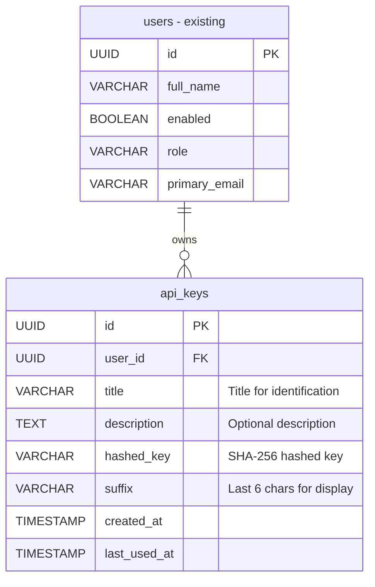

# API Key Authentication

At the time of writing (02/02/2026), the Australian Ad Observatory API supports authentication exclusively through JSON Web Tokens (JWT). While JWTs work well for user sessions in web applications, they have limitations for programmatic access:

- **Short-lived tokens**: JWTs expire after a configured period (default: 24 hours), requiring frequent re-authentication
- **Complex integration**: Scripts and automation tools must implement login flows to obtain tokens
- **Session management**: External integrations need to handle token refresh logic

## Requirements

To address these limitations, implement API key authentication as an alternative mechanism alongside JWT, with the following requirements:

- **API Key Management**:
  - Users with "User" or "Admin" role can create API keys for their own account
  - Users can list their own API keys
  - Users can delete their own API keys
  - Admins can list and delete any user's API keys
  - API keys must have a `title` and optional `description` for identification
  - API keys are shown in full only once upon creation

- **Authentication**:
  - API keys should be accepted via the `X-API-KEY` header
  - The authenticate middleware should support both JWT (`Authorization: Bearer`) and API keys (`X-API-KEY`)
  - When authenticated via API key, the same `event['user']` structure should be populated
  - API keys should not expire (unlike JWTs), but can be revoked by deletion

- **Security**:
  - API keys must be hashed before storage (similar to passwords)
  - The original API key should never be stored or recoverable
  - API keys should be sufficiently random and long (64 characters)
  - API keys do not require any prefix; instead, the system will display the **last 6 characters** (suffix) of the key to help users identify keys without exposing the full value (e.g., `mnopqr`) 

- **Backward Compatibility**: Existing JWT authentication must continue to work unchanged
- **Documentation**: OpenAPI specification should support `X-API-KEY` as a security scheme
- **Performance**: API key validation should be efficient with proper database indexing

## Data Structure

Below are the data structures involved in the API key authentication feature.

### API Key Entity

**Database Schema (PostgreSQL)**

```sql
CREATE TABLE api_keys (
    id UUID PRIMARY KEY DEFAULT gen_random_uuid(),
    user_id UUID NOT NULL REFERENCES users(id) ON DELETE CASCADE,
    title VARCHAR(255) NOT NULL,
    description TEXT,
    hashed_key VARCHAR(255) NOT NULL,
    suffix VARCHAR(6) NOT NULL,  -- Last 6 characters for display
    created_at TIMESTAMP NOT NULL DEFAULT CURRENT_TIMESTAMP,
    last_used_at TIMESTAMP,
    
    CONSTRAINT unique_hashed_key UNIQUE (hashed_key)
);

CREATE INDEX idx_api_keys_user_id ON api_keys(user_id);
CREATE INDEX idx_api_keys_hashed_key ON api_keys(hashed_key);
CREATE INDEX idx_api_keys_suffix ON api_keys(suffix);
```



**Pydantic Model**

```python
class ApiKey(BaseModel):
    id: str
    user_id: str
    title: str
    description: str | None = None
    suffix: str  # last 6 characters
    created_at: datetime
    last_used_at: datetime | None = None

class ApiKeyCreate(BaseModel):
    title: str
    description: str | None = None
```

**API Key Format**

```
{64_random_characters}
Note: Keys should be generated using `secrets.token_urlsafe(64)` and will be treated as opaque strings by the server.
Example: 3gpw2du1KS3vSXjGT5WiWAm98qfKwcWVo8JEyBKCbRUR3FQ9D_8majf9gXNvLD0Kvswuy24EL5JwHGdfmnopqr
```

### API Responses

**Create API Key Request (`POST /api-keys`)**

```json
{
  "title": "Data Export Script",
  "description": "API key for automated data export pipeline"
}
```

**Create API Key Response**

```json
{
  "success": true,
  "api_key": {
    "id": "550e8400-e29b-41d4-a716-446655440000",
    "title": "Data Export Script",
    "description": "API key for automated data export pipeline",
    "suffix": "mnopqr",
    "key": "k8f3j2h5g9m1n4p7q0r6s8t2u5v9w3x1y7z8a9b0c1d2e3f4g5h6i7j8k9l0mnopqr",
    "created_at": "2026-02-02T10:30:00Z"
  },
  "warning": "Store this key securely. It will not be shown again."
}
```

**List API Keys Response (`GET /api-keys`)**

```json
{
  "api_keys": [
    {
      "id": "550e8400-e29b-41d4-a716-446655440000",
      "title": "Data Export Script",
      "description": "API key for automated data export pipeline",
      "suffix": "mnopqr",
      "created_at": "2026-02-02T10:30:00Z",
      "last_used_at": "2026-02-02T14:45:00Z"
    }
  ]
}
```

## API Endpoints

### `POST /api-keys`

Create a new API key for the authenticated user.

**Authentication**: JWT required (User or Admin role)

**Request Body**:
```json
{
  "title": "string (required)",
  "description": "string (optional)"
}
```

**Responses**:
- `201`: API key created successfully (includes full key)
- `400`: Invalid request body
- `401`: Not authenticated
- `403`: Insufficient permissions

### `GET /api-keys`

List all API keys for the authenticated user.

**Authentication**: JWT required

**Query Parameters**:
- `user_id` (optional, admin only): List keys for a specific user

**Responses**:
- `200`: List of API keys (without the actual key values)
- `401`: Not authenticated
- `403`: Insufficient permissions (non-admin trying to view other user's keys)

### `GET /api-keys/{key_id}`

Get details of a specific API key.

**Authentication**: JWT required

**Responses**:
- `200`: API key details
- `401`: Not authenticated
- `403`: Key belongs to another user (non-admin)
- `404`: Key not found

### `DELETE /api-keys/{key_id}`

Delete (revoke) an API key.

**Authentication**: JWT required

**Responses**:
- `200`: Key deleted successfully
- `401`: Not authenticated
- `403`: Key belongs to another user (non-admin)
- `404`: Key not found

## Implementation Steps

### Milestone 1: Database Schema and Models

Create the database schema and models to support API key storage.

**Tasks**:
- [ ] Create Alembic migration for `api_keys` table
- [ ] Implement `ApiKeyORM` in `models/api_key.py`
- [ ] Add relationship to `UserORM` in `models/user.py`
- [ ] Configure repository in `db/shared_repositories.py`

### Milestone 2: API Key Utilities

Implement utility functions for API key generation, hashing, and verification in `utils/api_key.py`.

**Tasks**:
- [ ] Implement `generate_api_key()` - returns `(full_key, hashed_key, suffix)`; use `secrets.token_urlsafe(64)` to generate the key
- [ ] Implement `hash_api_key(api_key)` - hash using SHA-256
- [ ] Implement `verify_api_key(api_key)` - check if key exists and is valid
- [ ] Implement `get_user_from_api_key(api_key)` - retrieve associated user
- [ ] Implement `update_last_used(api_key)` - update timestamp on each use
- [ ] Ensure `suffix` stores the last 6 characters of the key and is returned in list/detail endpoints (never the full key)

### Milestone 3: Authentication Middleware

Update the authentication middleware (`middlewares/authenticate.py`) to support both JWT and API key authentication.

**Tasks**:
- [ ] Refactor `authenticate` middleware to check for both auth methods
- [ ] Implement `authenticate_with_api_key` function
- [ ] Refactor existing JWT code into `authenticate_with_jwt` function
- [ ] Add `event['auth_method']` to track authentication method used (`'jwt'` or `'api_key'`)
- [ ] Set `event['identity'] = None` for API key authentication (no associated identity)
- [ ] Set `event['user']` based on API key owner
- [ ] Update middleware docstring for OpenAPI generation

### Milestone 4: API Endpoints

Implement the CRUD endpoints for API key management in `routes/api_keys.py`.

**Tasks**:
- [ ] Implement `POST /api-keys` - create new API key
- [ ] Implement `GET /api-keys` - list user's API keys (with admin override via `user_id` query param)
- [ ] Implement `GET /api-keys/{key_id}` - get specific API key details
- [ ] Implement `DELETE /api-keys/{key_id}` - revoke an API key
- [ ] Register routes in `routes/__init__.py`

### Milestone 5: Documentation and Testing

Update documentation and implement tests.

**Tasks**:
- [ ] Update `scripts/docgen.py` to add `apiKeyAuth` security scheme to OpenAPI spec
- [ ] Add unit tests for API key utilities in `unittests/test_api_key.py`
- [ ] Add integration tests for API key endpoints in `apitests/test_api_keys.py`
- [ ] Add tests for API key authentication flow
- [ ] Update `docs/middlewares/authentication.md` with API key usage examples

## Security Considerations

1. **Key Storage**: API keys are hashed using SHA-256 with a server-side salt before storage. The salt should be configured in `config.ini` (see Configuration section below). The original key is only shown once upon creation and is never stored in plaintext.

1. **Audit Logging**: Track API key usage with `last_used_at` for security auditing.

1. **Revocation**: Deleting an API key immediately invalidates it. There's no grace period.

1. **Scope Limitation**: Currently, API keys have the same permissions as the associated user. Consider adding scoped permissions in the future.

## Configuration

Add a salt value to `config.ini` to be used when hashing API keys. Define it similarly to the JWT secret, for example:

```ini
[API_KEY]
SALT = your-secure-random-salt-value
```

Notes:
- Update `config.py` to load it into the application configuration so that `utils/api_key` can use it when hashing keys.